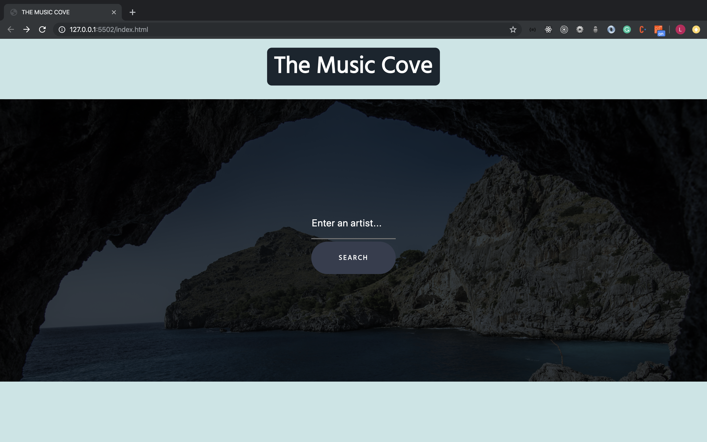
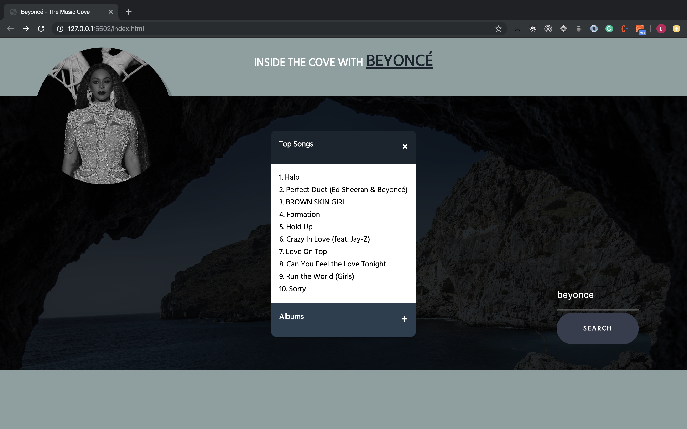
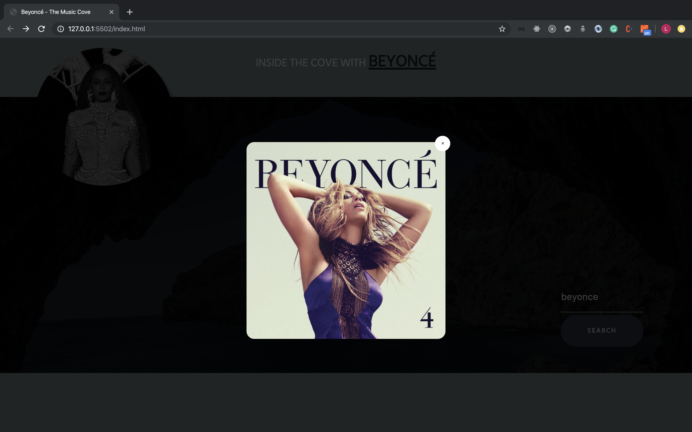

# ui-pattern-project

The purpose of this repository was to populate UI patterns with data from an API. This website displays data from the Spotify API  using an accordian menu and modals. 

## Website

[The Music Cove](https://llucas314.github.io/ui-pattern-project/)

## Screenshots

## Built With

* Javascript
* HTML
* CSS

## How to Run

1. Fork and clone this repository.
2. Open index.html in your browser.
3. You may have to use CORS for the site to access the API. Follow [this link](https://chrome.google.com/webstore/detail/allow-cors-access-control/lhobafahddgcelffkeicbaginigeejlf?hl=en "Allow CORS: Access-Control-Allow-Origin") or [this link](https://chrome.google.com/webstore/detail/moesif-orign-cors-changer/digfbfaphojjndkpccljibejjbppifbc?hl=en-US "Moesif Orign & CORS Changer") to install the extensions in Chrome.

  
## Contributing
In order to add to this repo you must optain an API key from [Spotify's](https://developer.spotify.com/documentation/web-api/quick-start/ "Spotify's Developer Site") developer site. The link provides a full description on how to recieve a key.

If you have any comments or suggestions please feel free to contact me.  

## Credits

* Spotify - for the API

* Background Photo by Stefan Kunze on Unsplash

## Authors

* Lorenzo Lucas 
